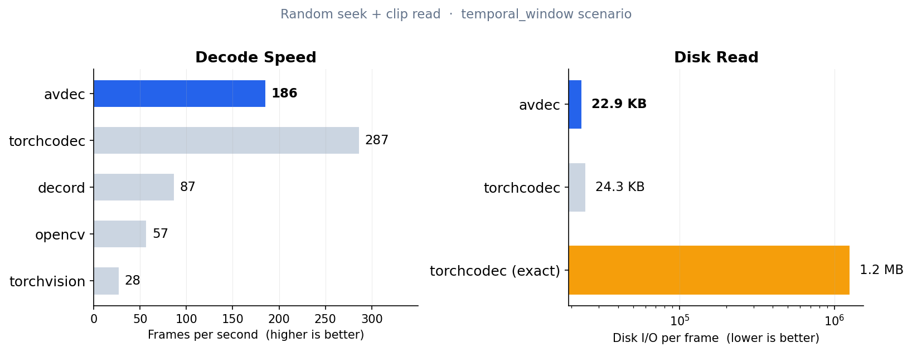

# avdec

[](https://pypi.org/project/avdec/)
[](https://pypi.org/project/avdec/)
[](https://github.com/MilkClouds/avdec/blob/main/LICENSE)

[**Installation**](#installation) | [**Quick Start**](#quick-start) | [**API Reference**](#api) | [**Contributing**](#contributing)

**Timestamp-based video decoder for VLA / robotics training — `pip install avdec`, NumPy output, no PyTorch required.**

```bash
pip install avdec
```

```python
from avdec import VideoDecoder

with VideoDecoder("video.mp4") as decoder:
    batch = decoder.get_frames_played_at([0.0, 1.0, 2.0])
    print(batch.data.shape)  # (3, 3, H, W) — NCHW uint8
```



> VLA-style workload: random seek + clip read on 64 × 5 min videos (640×480, H.264, 30 fps, GOP 10). [Full results →](benchmarks/RESULTS.md)

| | decord | TorchCodec | **avdec** |
|---|---|---|---|
| **Frame at *t* seconds** | ❌ index-only | ✅ | ✅ |
| **PyTorch-free** | ✅ | ❌ | ✅ |
| **Just `pip install`** | ⚠️ unmaintained since 2021 | ⚠️ PyTorch + CUDA + FFmpeg | ✅ |

---

## Why avdec?

avdec is a video decoder for **ML training data loading** — not for playback, editing, or streaming. It targets one specific access pattern: **random seek by timestamp + short clip read**, the same pattern found in VLA (Vision-Language-Action) and robotics training pipelines such as [LeRobot](https://github.com/huggingface/lerobot) and [MediaRef](https://github.com/open-world-agents/mediaref).

### Timestamp-only by design

In VLA training, you sample clips at random *times* across videos of varying frame rates. The question is always "what frame is displayed at *t* seconds?", not "give me frame #*N*".

avdec exposes only two methods — `get_frames_played_at(seconds)` and `get_frames_played_in_range(start, stop)` — and no index-based access. This is a deliberate choice:

- **decord** provides `vr[i]` and `get_batch([i, j, k])` — index-first. To get "the frame at 2.5 s" you must manually compute `int(2.5 * fps)`, which breaks on variable-frame-rate videos.
- **TorchCodec** supports both timestamp and index access. avdec shares its timestamp API and [playback-frame semantics](docs/playback_semantics.md) (`frame[i].pts ≤ t < frame[i+1].pts`), but drops the index path and the PyTorch dependency.

### What you get

1. **Single `pip install`, nothing else.** PyAV wheels [bundle FFmpeg](https://pyav.basswood-io.com/docs/stable/overview/installation.html) — no system packages, no `conda install ffmpeg`, no version matrix. The entire dependency tree comes from PyPI.

2. **Correct frame selection by default.** Playback-frame semantics guarantee the frame that *would be displayed* at each requested timestamp. avdec's output is [tested frame-by-frame against TorchCodec](tests/test_torchcodec_compat.py).

3. **I/O-efficient seeking.** On random-access workloads avdec reads **20 KB/frame** from disk — on par with TorchCodec approximate mode (21.4 KB). This matters on network storage and shared clusters.

4. **Stable across containers.** avdec delegates seeking to FFmpeg via [PyAV](https://pyav.basswood-io.com/) — performance is consistent across MP4, MKV, WebM, AVI, and MPEG-TS regardless of codec. [Details →](docs/container_robustness.md)

<!-- 5. **Pre-training video diagnostics.** `avdec.doctor()` inspects videos and reports issues (sparse keyframes, VFR, misplaced moov atom) with concrete `ffmpeg` fix commands — before training begins. -->

### What avdec does *not* do

- Frame-index access (`decoder[i]`) — unnecessary for timestamp-based training pipelines.
- GPU decoding — if you need NVDEC, use TorchCodec.
- Sequential streaming — for sequential throughput, TorchCodec with multi-threading is faster (2,325 vs 654 FPS).

## Installation

```bash
pip install avdec
```

**Requirements:** Python 3.9+ · `av>=15.0` · `numpy>=1.20`

That's the entire dependency tree — FFmpeg is bundled inside the PyAV wheel. No system packages, no `apt-get`, no `conda install ffmpeg`. Works on **Linux**, **macOS**, and **Windows**.

## Quick Start

### Decode frames at specific timestamps

```python
from avdec import VideoDecoder

with VideoDecoder("video.mp4") as decoder:
    # Frames at specific timestamps (playback semantics)
    batch = decoder.get_frames_played_at([0.0, 1.0, 2.0])
    print(batch.data.shape)  # (3, 3, H, W) — NCHW uint8
    print(batch.pts_seconds) # [0.0, 1.0, 2.0]
```

### Decode a time range

```python
with VideoDecoder("video.mp4") as decoder:
    # All frames in [start, stop)
    batch = decoder.get_frames_played_in_range(0.0, 5.0)

    # Resample to a fixed FPS
    batch = decoder.get_frames_played_in_range(0.0, 5.0, fps=10.0)
```

### Inspect video metadata

```python
with VideoDecoder("video.mp4") as decoder:
    m = decoder.metadata
    print(f"{m.num_frames} frames, {m.duration_seconds}s, "
          f"{m.width}×{m.height} @ {float(m.average_rate):.1f} fps")
```

<!-- ### Diagnose videos for training

```python
import avdec

report = avdec.doctor("video.mp4")
print(report)
```

```
┌ video.mp4
│ mov / h264 / 1920×1080
│ 9000 frames / 300.0s / 30.00fps
└ 648.2 MB

⚠ Random frame access is slow
   To read a random frame from this video,
   you must first decode 150 frames on average.
   ...
   Recommendation: For training, re-encode with keyframe interval of 1 sec

   $ ffmpeg -i "video.mp4" -c:v libx264 -g 30 -c:a copy "video_fixed.mp4"
``` -->

## API

### `VideoDecoder(source, *, stream_index=None)`

Opens a video file for decoding.

- **`get_frames_played_at(seconds: list[float]) -> FrameBatch`** — Returns frames using playback semantics: frame *i* where `frame[i].pts <= timestamp < frame[i+1].pts`.
- **`get_frames_played_in_range(start, stop, fps=None) -> FrameBatch`** — Returns all frames in `[start, stop)`. Pass `fps` to resample to a fixed frame rate.
- **`metadata`** — `VideoStreamMetadata` with `num_frames`, `duration_seconds`, `average_rate`, `width`, `height`, `begin_stream_seconds`, `end_stream_seconds`.
- **`close()`** / context manager — Releases resources.

### `FrameBatch`

Dataclass returned by both methods:

| Field | Type | Description |
|-------|------|-------------|
| `data` | `np.ndarray` | `(N, C, H, W)` uint8 |
| `pts_seconds` | `np.ndarray` | `(N,)` float64 — presentation timestamps |
| `duration_seconds` | `np.ndarray` | `(N,)` float64 — per-frame durations |

<!-- ### `doctor(path) -> DiagnosticReport`

Analyzes a video for ML training suitability — keyframe intervals, frame rate consistency, moov atom position. Returns actionable findings with `ffmpeg` fix commands. -->

## Contributing

Contributions are welcome! Please open an issue or submit a pull request on [GitHub](https://github.com/MilkClouds/avdec).

```bash
git clone https://github.com/MilkClouds/avdec.git
cd avdec
pip install -e ".[dev]"
pytest
```

## License

[MIT](https://github.com/MilkClouds/avdec/blob/main/LICENSE)
